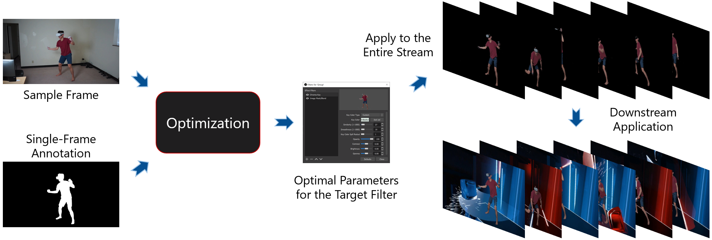

# OptiChroma &mdash; Automatic Optimal Parameters for Choma Key Filters

    

Chroma key filters typically require delicate parameter tuning for the optimal results. Such a process becomes quite challenging when no green screen is available &mdash; it's unclear which key color to use for a diverse background. This repository provides a solution that automatically searches for the optimal parameters for the target filter.

The filters are implemented using PyTorch and thus can be run with both CPU and CUDA. Currently, only random search is implemented for the optimization. However, the PyTorch implementation makes it straight-forward to incorporate gradient-based optimization techniques.

